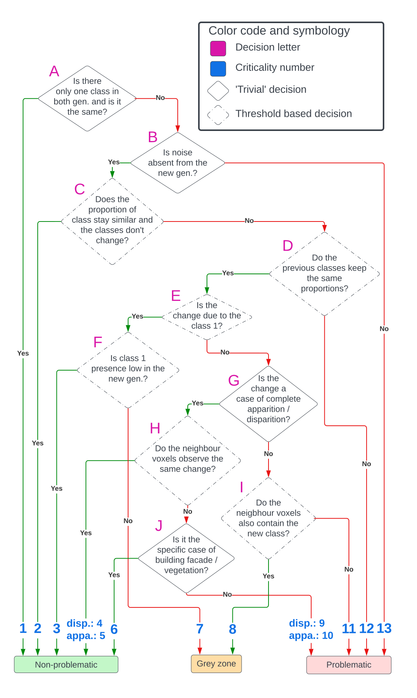

# Cross-generation change detection between two classified LiDAR point clouds for a semi-automated quality control

**Table of content**

- [Introduction](#introduction)
- [Requirements](#requirements)
    - [Hardware](#hardware-requirements)
    - [Software](#software-requirements)
- [Data](#data)
    - [Point clouds](#point-clouds)
    - [Class equivalence](#class-equivalence)
- [Workflow](#workflow)
- [Additional information](#additional-information)

## Introduction

This project provides a set of scripts to detect changes between a reference point cloud and a new point cloud. The goal is to highlight areas of change in the new point cloud to make the control process faster for an operator. <br>
It performs voxelization and compare the class distribution in the voxels. The changes are classified by type and criticality level. The global workflow is summarized on Figure 1.

<div align="center" style="font-style: italic">
  <br>
  <figcaption><i>Figure 1: Overview of the workflow for change detection and assignment of a criticality level to the detected changes.</i></figcaption>
</div>
<br>

The full documentation of the project is available on the STDL's [technical website](https://tech.stdl.ch/PROJ-QALIDAR/).

## Requirements

### Hardware requirements

No specific hardware is needed. However, the RAM must be big enough for the dimension of the point cloud. <br>
We conducted successfully our tests on a machine with 16 GB of RAM and point cloud tiles of dimension 2km x 2km with an approximate density of 15-20 pts/m<sup>2</sup> for the reference generation and 100 pts/<sup>2</sup> for the new generation.


### Software requirements

* Python 3.10: the dependencies may be installed with either `pip` or `conda`, by making use of the provided `requirements.txt` file. 
```bash
conda create -n <environment_name> python=3.10
conda activate <environment_name> 
pip install -r requirements.txt
```
* (Optional) [LAStools](https://lastools.github.io/): some pre-processing scripts rely on the function `las2las` from LAStools to reclassify the point clouds and modify the tiling. This function is in the open-source part of LAStools. The change detection process itself relies only on Python libraries.


## Data

### Point clouds

In order to run the change detection, at least two point clouds are required, one acting as the reference and the other as the point cloud to control. The expected format is LAS or LAZ.  <br>
The workflow is based on the assumption that the two point clouds cover the same area and have the same coordinate system (i.e. no point cloud registration is performed). <br>
It is necessary for the two tiles to share the same name, although the file formatting can differ. <br>

|   | Tile 1        | Tile 2              |
|---|---------------|---------------------|
| ✅ | 2533_1155.las | 2533_1155.las       |
| ✅ | tile_1.laz    | tile_1.las          |
| ❌ | 2533_1155.las | 2533000_1155000.las |
| ❌ | tile_prev.las | tile_new.las |

The reference and evaluated tiles are to be stored in two separate folders, whose paths must be provided in the YAML file with *prev_folder* and *new_folder* respectively. 

The script *retile_las.py* was used in order to create tiles of the same dimension. It can be launched along the config file with:
```
python scripts/retile_las.py -cfg config.yml
```

### Class equivalence
Correspondence between the old and new classes is needed. It must be provided in the CSV *classes_equivalence.csv*. 

Every class which is present in the newer point cloud must be provided in the *id* column. The overarching class from the reference generation must be indicated in the *matched_id* column. Note that the column *class_name* is purely for understandability purpose and does not need to be filled, or can even be removed. Observe that classes that are preserved should also be defined in the CSV file. The file provided in this repository is designed to be used with the classes of the 1st generation of [swissSURFACE3D](https://www.swisstopo.admin.ch/en/height-model-swisssurface3d) as the reference set and the classes of the [Canton of Neuchâtel (2022)](https://www.ne.ch/autorites/DDTE/SGRF/SITN/Pages/geodonnees3d.aspx) as the new classes. 

## Workflow

The change detection can be launched with:

```bash
python scripts/change_detection.py -cfg config.yml
```

With the default configuration, the change detection runs on all tiles provided in the input folder and produce a shapefile. The configuration can be adjusted through the file `config.yml`. <br>

The process goes through the following **substeps**:

1. **Voxelization**: Creates a common grid of voxels for the two point clouds and resume the class distribution in each voxel in the form of a Panda dataframe.
2. **Decision tree**: All voxels are assigned a criticality level.
3. **DBSCAN**:The problematic voxels are filtered out if they are isolated, following a clustering made with the algorithm DBSCAN
4. **Visualization** : The detections are converted in a file format for analysis: as a LAS file in 3D, as a shapefile in 2D.

If desired, each substep can be run individually on a single tile. For example:

```bash
python scripts/substeps/voxelisation.py -cfg config.yml
```

## Additional information

The full decision tree to sort the voxels is given in Figure 2. It sorts the voxels by criticality level (non-problematic, grey zone, problematic) and by type of change, designated by the criticality number.

<div align="center" style="font-style: italic">
  <br>
  <figcaption><i>Figure 2: Decision tree.</i></figcaption>
</div>
<br>

The criticality numbers correspond to the following definitions:

- Grey zone:
    - **7 - Increase in the unclassified points**: Appearance of a voxel or change in the class proportions due to *unclassified* points in the new generation;
    - **8 - Presence of extra classes in the area**: Change in the class distribution due to extra classes present in the voxel compared to the reference generation. The neighboring voxels share the same class occupancy.

- Problematic:
    - **9 - Disappearance of geometry**: Disappearance, i.e. a voxel which contains points in the reference, but no points in the new point cloud. The neighboring voxels do not show the same change;
    - **10 - Appearance of geometry**: Appearance, i.e. a voxel which contains no points in the reference, but is filled in the new point cloud. The neighboring voxels do not show the same change;
    - **11- Isolated minor class change**: Change in the class distribution due to extra classes present in the voxel compared to the reference generation. The neighboring voxels do not share the same class occupancy;
    - **12 - Major changes in the distribution**: Changes in the distribution for classes previously and newly present in the voxel;
    - **13 - Noise**: Presence of points classified as noise in the new point cloud.